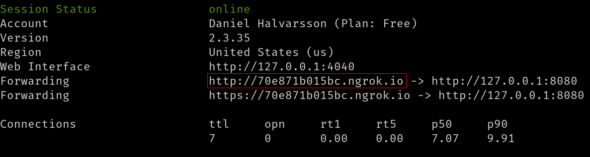
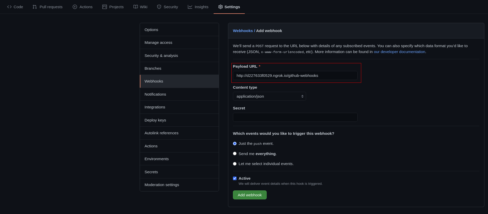

# Assignment-2-CI

## Info
The CI server is built using **Java 11** and [**Gradle 6.8.1**](https://gradle.org/releases/) for building and testing the application. [**ngrok**](https://ngrok.com/) is used to host the server.
Furthermore, the java library: [json-simple-1.1.1](https://code.google.com/archive/p/json-simple/downloads) is used for processing JSON data.

## Setting up the server

For this project we use [**ngrok**](https://ngrok.com/) with our own machines to host the CI server. The URL provided by ngrok is publically accessible on the internet.
Run:
```
ngrok http 127.0.0.1:8080
```
To make localhost accessible on the internet where the web server runs on port 8080.


## Configuring webhooks

Github webhooks is what allows us to be notified when a github event, such as a push, occurs. For this server we only require the push event. Github webhooks can be configured in the settings of a repository. The POST requests generated by these hooks are expected to be sent to the path: **\"/github-webhooks\"** of the main ngrok URL.


## Building and Running the server

To run:
```
./gradlew run
```
This starts the server. Any triggered events, which are included in our webhook configuration, should now successfully send POST requests to our server on the configured path.

To test:
```
./gradlew test
```
This runs the implemented unit tests. Used by the server to verify that the
tests pass.

To build:
```
./gradlew build
```
This is used by the server to verify that commits that are pushed to the Github
repository compile.


TEST COMMIT!

2

3